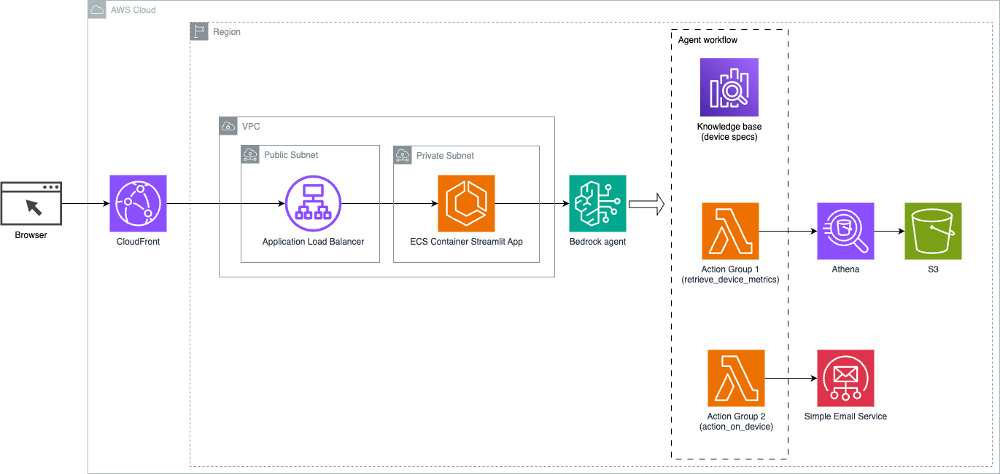

# Bedrock Agent and Knowledge Base Implementation

## Overview

This folder contains the [Bedrock Agent and Knowledge Base](https://aws.amazon.com/bedrock/agents/) implementation for multi-route conversational AI use case. Leveraging Bedrock Agent and Knowledge Base provides a strategic advantage by simplifying infrastructure management, enhancing scalability, improving security, and alleviate undifferentiated heavy lifting.

## Architectural diagram



## Features

- **Conversational Interface**: Streamlit UI running on ECS provides a natural language interface for users to interact with and seek assistance in troubleshooting issues within a factory plant environment. 

- **Bedrock Agent**: completes the user queries through series of reasoning steps and corresponding actions based on (ReAct prompting)[https://www.promptingguide.ai/techniques/react].

- **Knowledge Base**: provide fully-managed (RAG)[https://www.promptingguide.ai/research/rag] to supply the agent with access to your data. In our use case, we have uploaded device specifications into an S3 bucket. It serves as the data source to the knowledge base.

## Setup

### Pre-requisites
1. [Enable models in Amazon Bedrock](https://docs.aws.amazon.com/bedrock/latest/userguide/model-access.html): for this use case, you need to enable Anthropic Claude V2 and Titan Embeddings models 
2. [SES setup (verify email)](https://docs.aws.amazon.com/ses/latest/dg/setting-up.html)
3. [Get started with CDK](https://docs.aws.amazon.com/cdk/v2/guide/getting_started.html)
4. [Install Docker](https://www.docker.com/get-started/). Because we are bundling Lambda functions when running CDK so we need to install Docker. Please see the blog post about [Building, bundling and deploying applications with the AWS CDK](https://aws.amazon.com/blogs/devops/building-apps-with-aws-cdk/)

### Run CDK
1. Change directory to `bedrock-agent-implementation`
    ```
    cdk synth -c sender=<the email verified in SES> -c recipient=<the email verified in SES> --all
    ```
2. Deploy the backend
    ```
    cdk deploy -c sender=<the email verified in SES> -c recipient=<the email verified in SES> --all --require-approval never
    ```

### Cleanup
Run the following commands to destroy all Stacks. 
```
cdk destroy -c sender=<the email verified in SES> -c recipient=<the email verified in SES> --all
```
Enter `y` upon the prompt to destroy each Stack.
