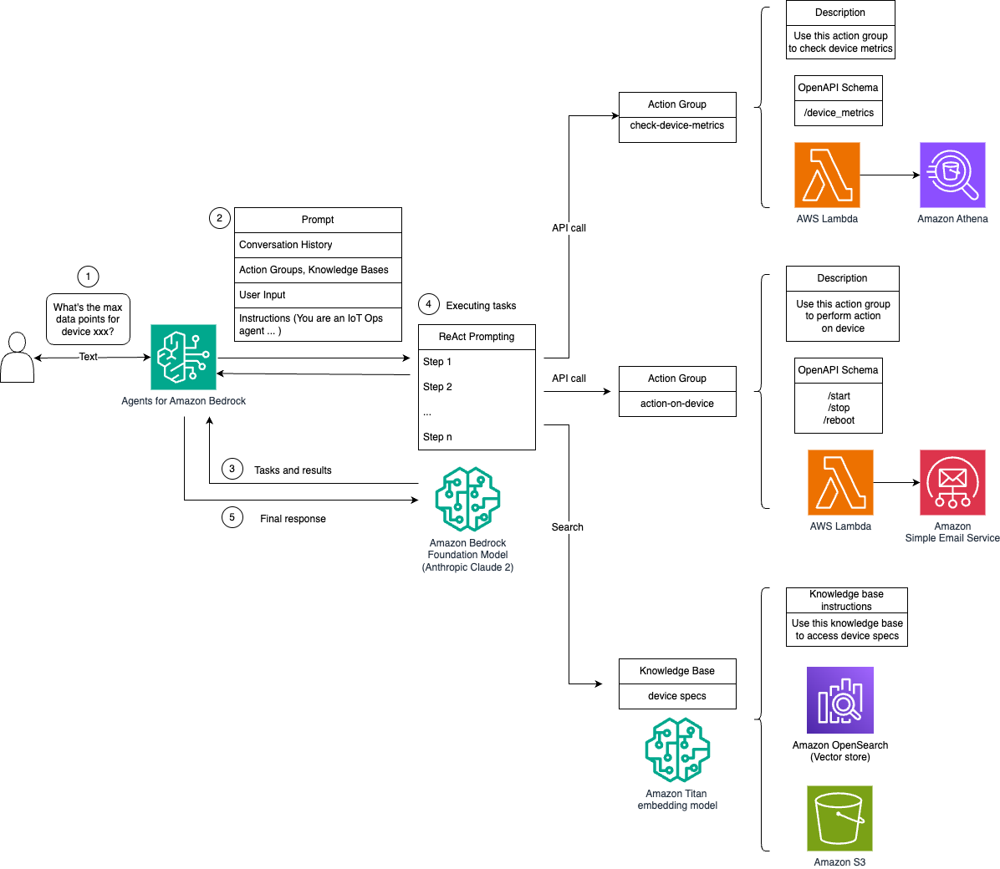
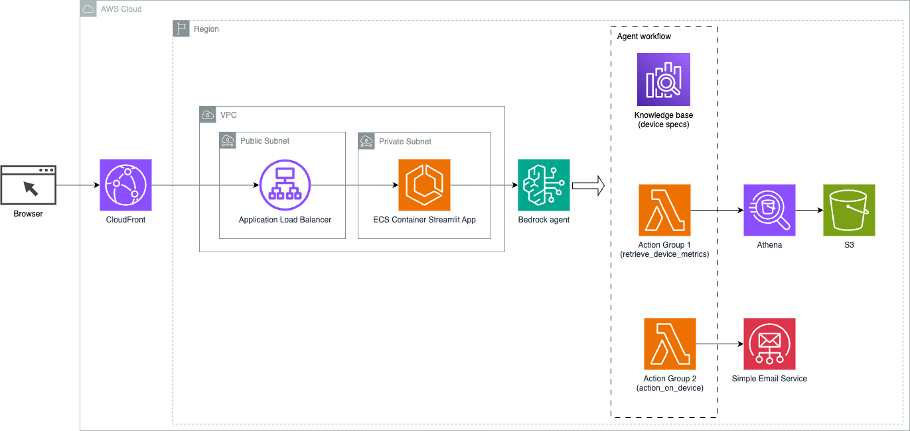
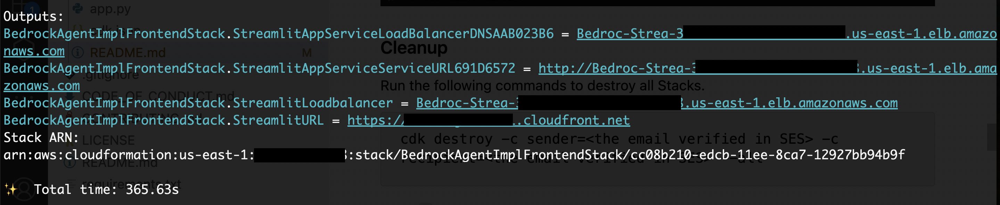

# Bedrock Agent and Knowledge Base Implementation

- [Bedrock Agent and Knowledge Base Implementation](#bedrock-agent-and-knowledge-base-implementation)
  - [Overview](#overview)
  - [Use case workflow](#use-case-workflow)
  - [Solution architecture](#solution-architecture)
  - [Features](#features)
  - [Setup](#setup)
    - [Pre-requisites](#pre-requisites)
    - [Run CDK](#run-cdk)
    - [Cleanup](#cleanup)

## Overview

This folder contains the [Bedrock Agent and Knowledge Base](https://aws.amazon.com/bedrock/agents/) implementation for multi-route conversational AI use case. Leveraging Bedrock Agent and Knowledge Base provides a strategic advantage by simplifying infrastructure management, enhancing scalability, improving security, and alleviate undifferentiated heavy lifting.

## Use case workflow



This solution leverages the Amazon Bedrock platform, which integrates an advanced AI model, the Amazon Bedrock Foundation Model (Anthropic Claude 2), to provide IoT device management and operations conversational AI assistant. The agent is prompted with following instruction: 

You are an IoT Ops agent that handles the following activities:- looking up IoT device information - checking IoT operating metrics (historical data) - performing actions on a device-by-device id - answer general questions You can check device information (Device Id, Features, Technical Specifications, Installation Guide, Maintenance and Troubleshooting, Safety Guidelines, Warranty and Support) from "IotDeviceSpecs" knowledge base. You can also check the device historical data or device metrics. The device metrics is stored in a Athena DB named "iot_ops_glue_db" table named "iot_device_metrics". The table has following schema: iot_device_metrics: fields: - name: oil_level type: double - name: temperature type: double - name: pressure type: double - name: received_at type: string - name: device_id type: bigint You can also perform actions (start, shutdown, reboot) on the device.

**Workflow**
1.	User Interaction The process begins when a user queries the system, for example, asking for the maximum data points for a specific IoT device (`device_xxx`). This text input is captured and sent to the AI agents.

2.	Processing Input: AI agents, powered by the Amazon Bedrock platform, interpret the user's text input. They use the provided conversation history, existing action groups, and knowledge bases to understand the context and determine the necessary tasks.

3.	Task Determination: Once the user's intent is parsed and understood, the AI agents define tasks and results. This is based on the instructions that are interpreted by the agents as per the user's input.

4.	Executing Tasks: The tasks are then executed through a series of API calls. This is done using ReAct prompting, which breaks down the task execution into a series of steps that are processed sequentially.

    -  For device metrics checks, the `check-device-metrics` action group is used, which involves an API call to AWS Lambda functions that then query Amazon Athena for the requested data.
    - For actions performed directly on the device, such as start, stop, or reboot commands, the `action-on-device` action group is used. This triggers an AWS Lambda function that sends commands to the IoT device, and notifications are sent through the Amazon Simple Email Service (SES) if needed. *The current `action_on_device` Lambda function only implements the logic of sending the email notification. Please consider to add your own logic of performing actions on the device*
    - Knowledge Base to fetch from historical data stored as embeddings in the OpenSearch VectorDB 

5.	Final Response: After the tasks are completed, the final response is generated by the Amazon Bedrock Foundation Model and conveyed back to the user.

## Solution architecture



## Features

- **Conversational Interface**: Streamlit UI running on ECS provides a natural language interface for users to interact with and seek assistance in troubleshooting issues within a factory plant environment. 

- **Bedrock Agent**: completes the user queries through series of reasoning steps and corresponding actions based on [ReAct prompting](https://www.promptingguide.ai/techniques/react).

- **Knowledge Base**: provide fully-managed [RAG](https://www.promptingguide.ai/research/rag) to supply the agent with access to your data. In our use case, we have uploaded device specifications into an S3 bucket. It serves as the data source to the knowledge base.

## Setup

### Pre-requisites
1. The solution is only available in `us-east-1` and `us-west-2`. Please choose either of them to proceed.
2. [Enable models in Amazon Bedrock](https://docs.aws.amazon.com/bedrock/latest/userguide/model-access.html): for this use case, you need to enable Anthropic Claude V3 Sonnet and Titan Embeddings models 
3. [SES setup (verify email)](https://docs.aws.amazon.com/ses/latest/dg/setting-up.html) `action_on_device` Lambda function implements the logic of sending email notificaiton. It is required to setup SES and verify and sender and recipient's emails beforehand. 
4. [Get started with CDK](https://docs.aws.amazon.com/cdk/v2/guide/getting_started.html).
5. [Install Docker](https://www.docker.com/get-started/). Because we are bundling Lambda functions when running CDK so we need to install Docker. Please see the blog post about [Building, bundling and deploying applications with the AWS CDK](https://aws.amazon.com/blogs/devops/building-apps-with-aws-cdk/)


### Run CDK
1. Clone this repository.
2. Export `AWS_DEFAULT_REGION` to either region following the [CDK cli guide](https://docs.aws.amazon.com/cdk/v2/guide/cli.html#cli-environment).
   ```
   export AWS_DEFAULT_REGION={us-east-1, us-west-2}
   ```
3. Change directory to `bedrock-agent-implementation`
4. To manually create a virtualenv on MacOS and Linux:
    ```
    python3 -m venv .venv
    ```
5. After the init process completes and the virtualenv is created, you can use the following
step to activate your virtualenv.

    ```
    source .venv/bin/activate
    ```

    If you are a Windows platform, you would activate the virtualenv like this:

    ```
    .venv\Scripts\activate.bat
    ```
6. Once the virtualenv is activated, you can install the required dependencies.

    ```
    pip install -r ../requirements.txt
    ```
7. CDK bootstrap 
   ```
   cdk bootstrap
   ```
8. At this point you can now synthesize the CloudFormation template for this code.
    ```
    cdk synth
    ```
9. Deploy the application
    ```
    cdk deploy --all \
    --require-approval never \
    --parameters BedrockAgentImplGenAIStack:sender=<The SES verified sender's email> \
    --parameters BedrockAgentImplGenAIStack:recipient=<The SES verified recipient's email>
    ```
Once the CDK deployment has completed, there will be a Streamlit URL printed out alongside with deployment time in CDK Outputs.



### Cleanup
Run the following commands to destroy all Stacks. 
```
cdk destroy --all
```
Enter `y` upon the prompt to destroy each Stack.
