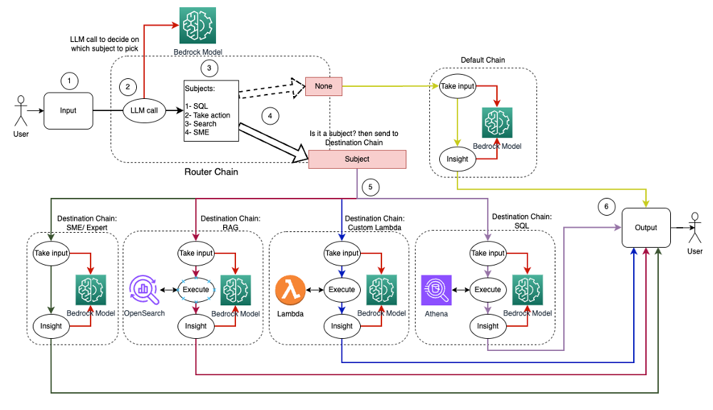
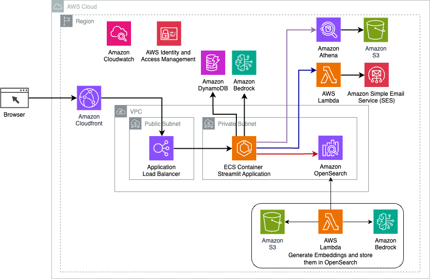
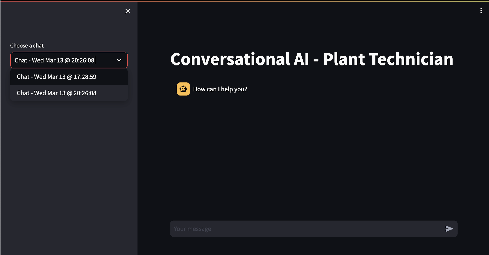
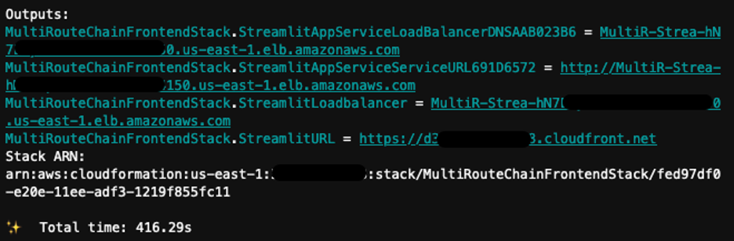

# Langchain Multi-route Implementation

- [Langchain Multi-route Implementation](#langchain-multi-route-implementation)
  - [Overview](#overview)
  - [Use case workflow](#use-case-workflow)
  - [Solution architecture](#solution-architecture)
    - [Memory implementation](#memory-implementation)
  - [Code struture](#code-struture)
  - [Setup](#setup)
    - [Pre-requisites](#pre-requisites)
    - [Run CDK](#run-cdk)
    - [Cleanup](#cleanup)
    - [Other considerations](#other-considerations)


## Overview

This folder provides a step-by-step guide on Langchain multi-route implementation, leveraging the Anthropic Claude V2 model alongside [Langchain](https://python.langchain.com/docs/integrations/llms/bedrock) to deliver various capabilities:

- **Querying Databases**: Demonstrates how to query an Athena database using Langchain's [SQLDatabaseChain](https://python.langchain.com/docs/use_cases/qa_structured/sql), enabling the AI to fetch and present data directly from structured databases in response to user queries.
- **Semantic Searches**: Shows how to perform advanced semantic searches within an OpenSearch Vector index by integrating Langchain's [ConversationalRetrievalChain](https://api.python.langchain.com/en/latest/chains/langchain.chains.conversational_retrieval.base.ConversationalRetrievalChain.html) and [OpenSearch](https://python.langchain.com/docs/integrations/vectorstores/opensearch), enhancing the AI's ability to understand and retrieve relevant information based on the context of the conversation.
- **Triggering Lambda Functions**: Illustrates how to execute custom Lambda functions for specific tasks through Langchain's [Custom Chain](https://python.langchain.com/docs/modules/chains/how_to/custom_chain), allowing for a wide range of actions, from data manipulation to initiating workflows, based on user requests.
- **Specialized Chatbot Interactions**: Explains how to use Langchain's [LLMChain](https://api.python.langchain.com/en/latest/chains/langchain.chains.llm.LLMChain.html#langchain.chains.llm.LLMChain) for engaging in specialized conversations and performing tasks by leveraging large language models, ensuring that the AI can handle a variety of user intents with high precision.
- **Natural Conversational Engagement**: Focuses on using the same [LLMChain](https://api.python.langchain.com/en/latest/chains/langchain.chains.llm.LLMChain.html#langchain.chains.llm.LLMChain) to maintain a natural and fluid conversation flow, making interactions feel more human-like and intuitive.

A key aspect covered is the preservation of conversation context and chat history, which is crucial for the AI to understand the user's ongoing intent and provide responses that are coherent and contextually enriched. Please review the Memory implementation section for an overview.

## Use case workflow



1.	User Input Reception: The user presents a question/query to the Conversational AI system.
2.	Initial LLM Evaluation: An LLM evaluates each question along with the chat history from the same session to determine its nature and which subject area it falls under (e.g., SQL, action, search, SME).
3.	Router Chain Activation:
    - If the question is identified with a subject, the Router Chain directs it to the corresponding Destination Chain.
    - The Default Chain handles queries that don't match specific subjects, providing insights through the Bedrock Model.
4.	Subject-Specific Routing:
    - SQL-related queries are sent to the SQL Destination Chain for database interactions.
    - Action-oriented questions trigger the Custom Lambda Destination Chain for executing operations.
    - Search-focused inquiries proceed to the RAG Destination Chain for information retrieval.
    - SME-related questions go to the SME/Expert Destination Chain for specialized insights.
5.	Destination Chain Processing: Each Destination Chain takes the input and executes the necessary models or functions:
    - SQL Chain uses [Amazon Athena](https://aws.amazon.com/athena) for executing queries.
    - RAG Chain utilizes [Amazon OpenSearch](https://aws.amazon.com/opensearch-service/serverless-vector-engine/) for semantic searches.
    - Custom Lambda Chain executes AWS Lambda functions for actions.
    - SME/Expert Chain provides insights via the Bedrock Model.
6.	Response Generation and Delivery: Responses from each Destination Chain are formulated into coherent insights by the LLM. These insights are then delivered to the user, completing the query cycle.

## Solution architecture




### Memory implementation

We use Langchain’s [Memory system](https://python.langchain.com/docs/modules/memory/) to add context for the LLM based on previous interactions. For example, if a user asks questions about a device, the LLM can determine the correct device ID as long as it was mentioned in a previous message. We use [RunnableWithMessageHistory](https://python.langchain.com/docs/expression_language/how_to/message_history) to add memory to specific chains. There are multiple memory implementations to store and retrieve history. We use AWS DynamoDB with langchain's [DynamoDBChatMessageHistory](https://python.langchain.com/docs/integrations/memory/aws_dynamodb) to externalize memory storage which allows for a loosely coupled design. It also provides persistent memory so that the user can recall and continue a previous chat session. This is shown in the following image. 



## Code struture

This folder helps to set up the multi-route chain app using [CDK](https://aws.amazon.com/cdk/). Specifically, it contains the following stacks:

- **MultiRouteChainBaseInfraStack**: it creates an S3 bucket and uploads all the data to be used by the Multi-route Chain APP to that bucket. It also creates the DynamoDB table to store chat history.
- **MultiRouteChainSqlChainStack**: it creates a Glue Crawler to crawl the data in the data bucket and sets up Athena data catelog.
- **MultiRouteChainRagStack**: it creates an OpenSearch serverless collection for vector search. And add the data into the index `docs`.
- **MultiRouteChainActionLambdaStack**: it creates an action lambda to send SES email. *Please consider to implement your own logic to perform actions on the device*
- **MultiRouteChainFrontendStack**: it creates a Streamlit app running on ECS Fargate to interact with the LLM.

## Setup

### Pre-requisites
1. The solution is only available in `us-east-1` and `us-west-2`. Please choose either of them to proceed.
2. [Enable models in Amazon Bedrock](https://docs.aws.amazon.com/bedrock/latest/userguide/model-access.html): for this use case, you need to enable Anthropic Claude V2 and Titan Embeddings models 
3. [SES setup (verify email)](https://docs.aws.amazon.com/ses/latest/dg/setting-up.html) `ses_action_lambda` Lambda function implements the logic of sending email notificaiton. It is required to setup SES and verify and sender and recipient's emails beforehand. 
4. [Get started with CDK](https://docs.aws.amazon.com/cdk/v2/guide/getting_started.html).
5. [Install Docker](https://www.docker.com/get-started/). Because we are bundling Lambda functions when running CDK so we need to install Docker. Please see the blog post about [Building, bundling and deploying applications with the AWS CDK](https://aws.amazon.com/blogs/devops/building-apps-with-aws-cdk/)


### Run CDK
1. Clone the repository.
2.  Export `AWS_DEFAULT_REGION` to either region following the [CDK cli guide](https://docs.aws.amazon.com/cdk/v2/guide/cli.html#cli-environment).
   ```
   export AWS_DEFAULT_REGION={us-east-1, us-west-2}
   ```
3. Change directory to `langchain-multi-route-implementation`
4. To manually create a virtualenv on MacOS and Linux:
    ```
    python3 -m venv .venv
    ```
5. After the init process completes and the virtualenv is created, you can use the following
step to activate your virtualenv.

    ```
    source .venv/bin/activate
    ```

    If you are a Windows platform, you would activate the virtualenv like this:

    ```
    .venv\Scripts\activate.bat
    ```
6. Once the virtualenv is activated, you can install the required dependencies.

    ```
    pip install -r ../requirements.txt
    ```
7. CDK bootstrap 
   ```
   cdk bootstrap -c sender=<the email verified in SES> -c recipient=<the email verified in SES> --all
   ```
8. At this point you can now synthesize the CloudFormation template for this code.
    ```
    cdk synth -c sender=<the email verified in SES> -c recipient=<the email verified in SES> --all
    ```
9.  Deploy the application
    ```
    cdk deploy -c sender=<the email verified in SES> -c recipient=<the email verified in SES> --all --require-approval never
    ```

Once the CDK deployment has completed, there will be a Streamlit URL printed out alongside with deployment time in CDK Outputs.



### Cleanup
Run the following commands to destroy all Stacks. 
```
cdk destroy -c sender=<the email verified in SES> -c recipient=<the email verified in SES> --all
```
Enter `y` upon the prompt to destroy each Stack.

### Other considerations

This section outlines additional security and cost related considerations for the solution

**Secure CDK deployments with IAM permission boundaries**

To initialize the CDK stack, we run `cdk bootstrap` which by default grants full `AdministratorAccess` to the CloudFormation deployment. For production deployments, we recommend following the [CDK security and safety development guide](https://github.com/aws/aws-cdk/wiki/Security-And-Safety-Dev-Guide) to properly configure least-privilege IAM permissions.

**Troubleshooting**

While interacting with the application you may encounter the following error in case an exception is thrown during request processing: `Error occurred when calling MultiRouteChain. Please review application logs for more information.`. In that case, please review the associated CloudWatch Logs log group for the exception name and detailed error message. To locate the correct log group, please navigate to the CloudWatch dashboard from the AWS Management Console and select **Log groups** from the left panel. Enter `Streamlit` in the log groups search box and select the log group title which begins with `MultiRouteChainFrontendStack`. Here you can select the Log stream associated with the error timeframe to troubleshoot further.

**CDK Nag Suppressions**

[cdk-nag](https://github.com/cdklabs/cdk-nag) is a tool used with the AWS Cloud Development Kit (CDK) to perform static analysis on your CDK application. It can help ensure the application complies with best practices and certain security baseline rules. Certain cdk-nag findings are suppressed for this solution which can be reviewed in the [app.py](app.py) file.

**CloudFront TLS Certificate Security Policy**

This soluton uses the Default CloudFront Certificate (*.cloudfront.net) which automatically sets the security policy to TLSv1. You may enforce a higher TLS version by associating your own TLS certificate to the CloudFront Distribution. Please reference [Supported protocols and ciphers between viewers and CloudFront](https://docs.aws.amazon.com/AmazonCloudFront/latest/DeveloperGuide/secure-connections-supported-viewer-protocols-ciphers.html) and [Using HTTPS with CloudFront](https://docs.aws.amazon.com/AmazonCloudFront/latest/DeveloperGuide/using-https.html#CNAMEsAndHTTPS)

**KMS Encryption for Athena query results**

The SQL Database chain in this solution uses Amazon Athena to run SQL queries on an S3 data source registered with the AWS Glue Data Catalog. You can optionally enable encryption at rest for Athena query results. Please follow the documentation link here for more information [Encrypting Athena query results stored in Amazon S3](https://docs.aws.amazon.com/athena/latest/ug/encrypting-query-results-stored-in-s3.html).

**Load balancer access logs and CloudWatch Container Insights**

This CDK project defines an Application Load Balancer as part of the [ApplicationLoadBalancedFargateService](https://docs.aws.amazon.com/cdk/api/v2/python/aws_cdk.aws_ecs_patterns/ApplicationLoadBalancedFargateService.html) construct. This contruct provides a Fargate service running on an ECS cluster fronted by an application load balancer. It is defined in the frontend Stack definition file [frontend_stack.py](/multi-route-chain-app/multi_route_chain_app/frontend_stack.py). The following features may be relevant for monitoring a troubleshooting the application.

- Elastic Load Balancing provides [access logs](https://docs.aws.amazon.com/elasticloadbalancing/latest/application/load-balancer-access-logs.html) that capture detailed information about requests sent to your load balancer. Each log contains information such as the time the request was received, the client's IP address, latencies, request paths, and server responses. You can use these access logs to analyze traffic patterns and troubleshoot issues.

- You can use [CloudWatch Container Insights](https://docs.aws.amazon.com/AmazonCloudWatch/latest/monitoring/ContainerInsights.html) to collect, aggregate, and summarize metrics and logs from your containerized applications and microservices. CloudWatch automatically collects metrics for many resources, such as CPU, memory, disk, and network. Container Insights also provides diagnostic information, such as container restart failures, to help you isolate issues and resolve them quickly. To enable Container Insights
